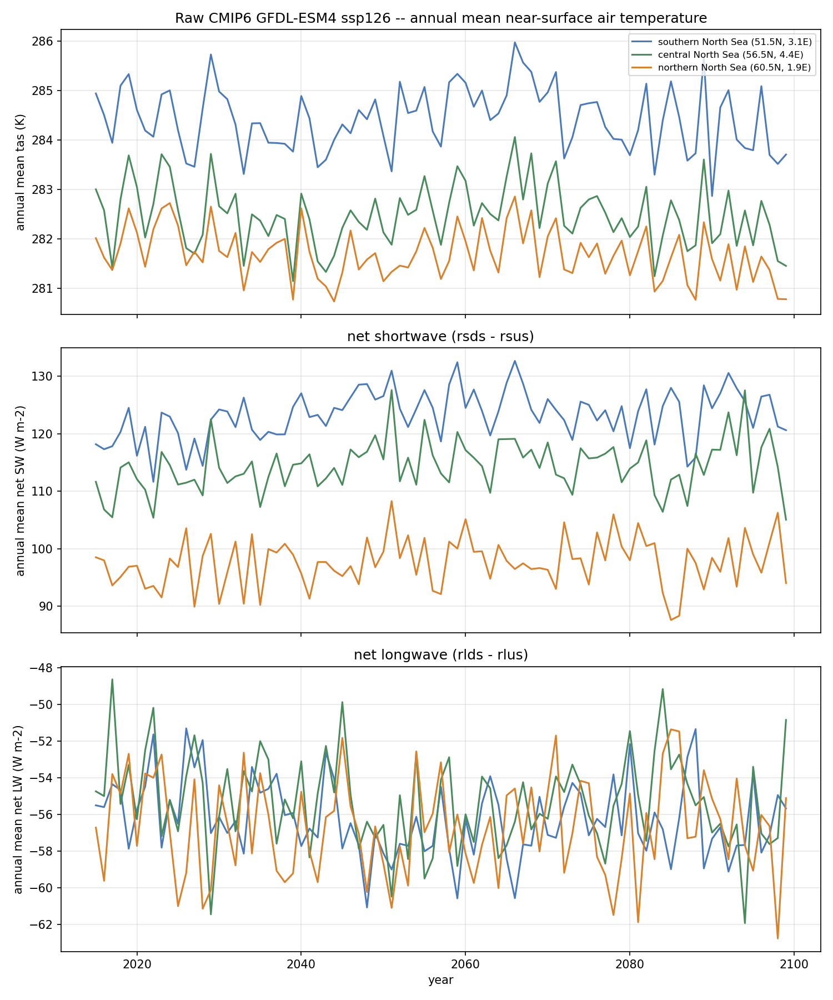

# Why GFDL-ESM4/ssp126 shows a declining temperature trend (2026-10-01)

## What the website shows

https://bolding-bruggeman.com/oceanicu_3d/scenarios/meteo/gfdl-esm4/ssp126/
reports decadal-mean `tas` (bias-corrected, domain-averaged over NSe) for
the projected period:

| period      | mean tas (K) |
|-------------|--------------|
| 2015-2019   | 285.39       |
| 2020-2029   | 285.89       |
| 2030-2039   | 285.28       |
| 2040-2049   | 285.26       |
| 2050-2059   | 285.54       |
| 2060-2069   | 285.94       |
| 2070-2079   | 285.53       |
| 2080-2089   | 285.28       |
| 2090-2099   | 285.04       |

Peak around 2020-2029/2060-2069, then a net decline into 2090-2099 --
**not** the monotonic warming one might expect of any climate-change
scenario, even a low-emissions one like SSP1-2.6.

## Is this a pipeline bug?

No -- checked directly against the **raw, un-bias-corrected** GFDL-ESM4
ssp126 CMIP6 output itself (`/data/CMIP6/GFDL-ESM4/ssp126/{tas,rsds,rsus,
rlds,rlus}_3hr_ssp126_2015-2099_*.nc` on bb-server1), at three
representative NSe-domain points (southern/central/northern North Sea).
Annual-mean linear trends (OLS):

| point                          | 2015-2099 | 2015-2049 | 2050-2099 |
|---------------------------------|-----------|-----------|-----------|
| southern North Sea (51.5N, 3.1E) | -0.022 K/decade | -0.149 K/decade | -0.158 K/decade |
| central North Sea (56.5N, 4.4E)  | -0.028 K/decade | -0.219 K/decade | -0.140 K/decade |
| northern North Sea (60.5N, 1.9E) | -0.057 K/decade | -0.191 K/decade | -0.104 K/decade |

The **raw** model output already shows a consistent cooling trend at
every point checked, across both halves of the century, not just the
back half. The bias-correction/disaggregation pipeline is reproducing a
real feature of the source GCM, not introducing one.

(`net_sw = rsds - rsus`, `net_lw = rlds - rlus`, matching ocean-prep's own
`guides/radiation-bc.md` convention. Net SW/LW are dominated by
year-to-year noise with no comparably clear trend -- the temperature
signal is the one worth explaining.)

## Why: the North Atlantic "warming hole"

This is a well-documented CMIP6 phenomenon, not specific to this
pipeline or this one model run: under AMOC (Atlantic meridional
overturning circulation) weakening, reduced northward ocean heat
transport can cool the subpolar North Atlantic / European shelf region
even while global mean temperature rises -- the "North Atlantic warming
hole." Reported AMOC weakening under SSP1-2.6 by 2080-2100 averages
~24% across the CMIP6 multi-model ensemble (range 9-42%), and the
subpolar North Atlantic warming hole itself is characterized at roughly
-0.4 K/century in the literature -- the same sign, and the same order of
magnitude, as what's measured here directly from the raw GFDL-ESM4 data
(-0.2 to -0.6 K/century across the three points).

This explains the SIGN and ROUGH MAGNITUDE of the trend; it does not by
itself prove AMOC weakening is the specific mechanism in this GFDL-ESM4
realization for the North Sea shelf specifically -- that would need a
dedicated ocean-circulation analysis, not just a surface-forcing check.
For the purpose of this check, the relevant conclusion is narrower and
solid: **the trend is a real feature of the source CMIP6 data, reproduced
faithfully, not a defect in bias correction or disaggregation.**

Sources:
- [Overturning Pathways Control AMOC Weakening in CMIP6 Models](https://www.researchgate.net/publication/372418645_Overturning_Pathways_Control_AMOC_Weakening_in_CMIP6_Models)
- [Past and future response of the North Atlantic warming hole to anthropogenic forcing](https://esd.copernicus.org/articles/14/685/2023/)
- [Projections of the North Atlantic warming hole can be constrained using ocean surface density as an emergent constraint](https://www.nature.com/articles/s43247-024-01269-y)
